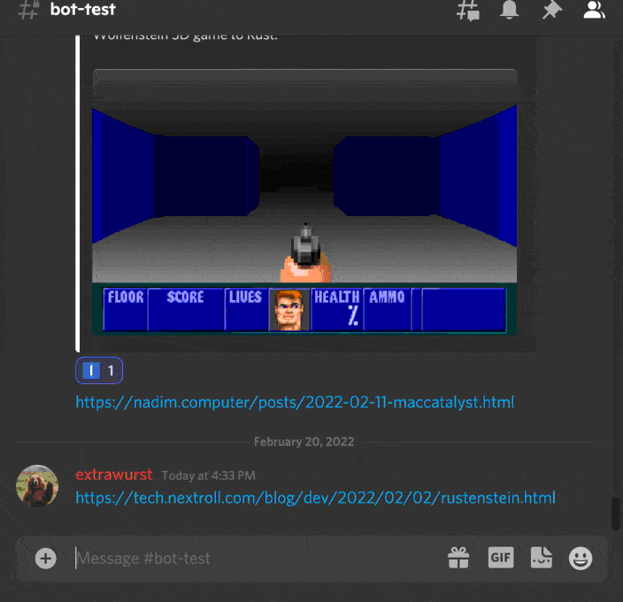

# twir-bot
Little 🤖 helping [TWIR](https://github.com/rust-lang/this-week-in-rust) 🦀 authors extracting gathered content from discord.

# context
The weekly updates from the community is assembled by a couple of contributors gathering links in a discord channel first for review and later assembly into a PR. Assembling the PR usually meant a lot of manual effort. This bot simplifies this a lot:

# TODO
* [ ] language tag detection on collection (+ reaction)
* [ ] on each new msg perform check if it would be added (+ reaction)